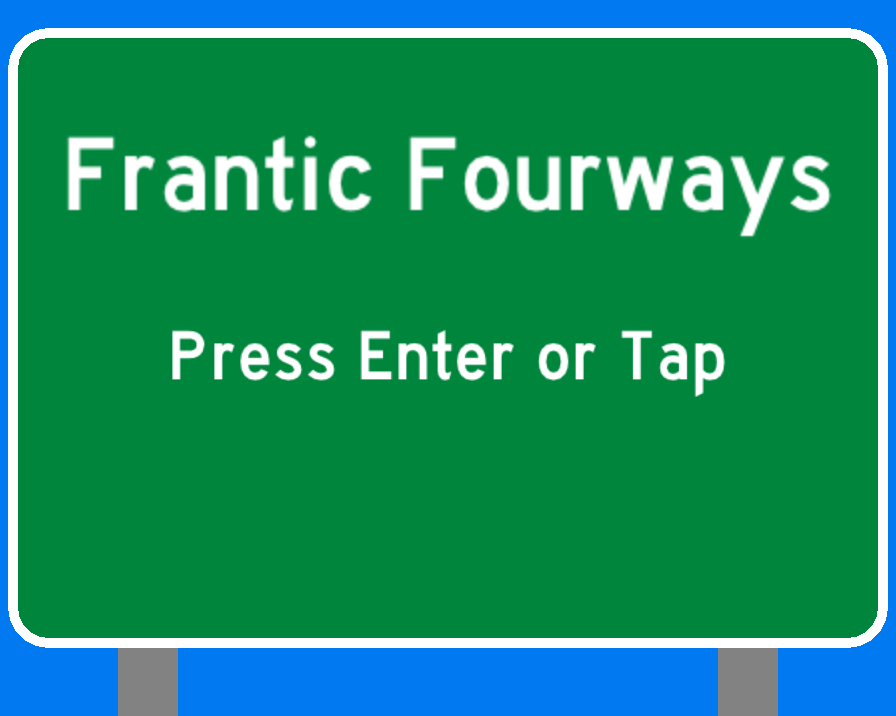
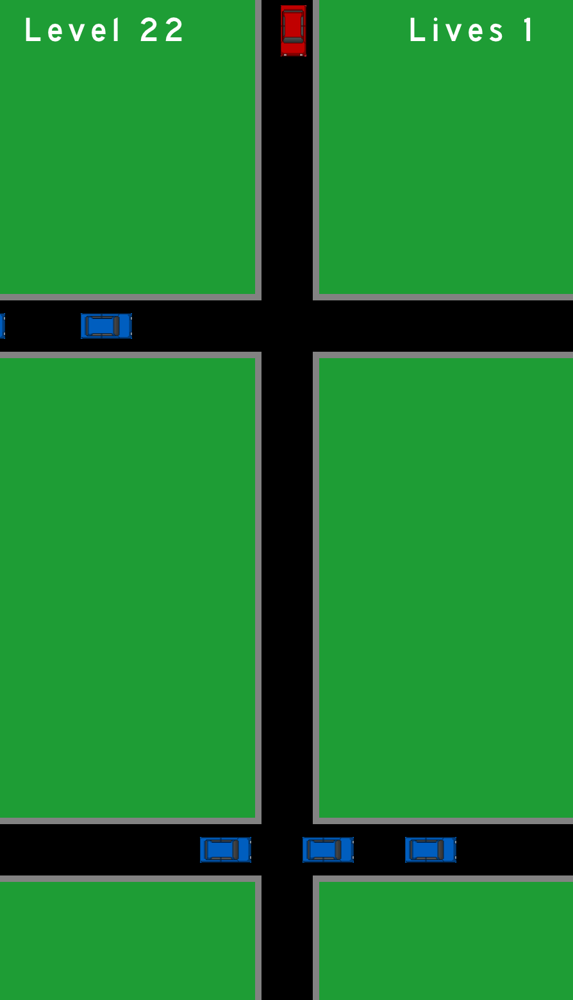
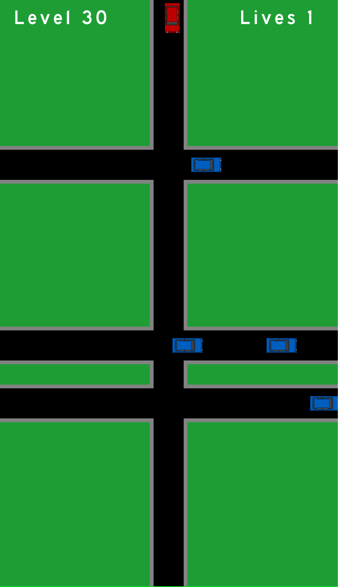
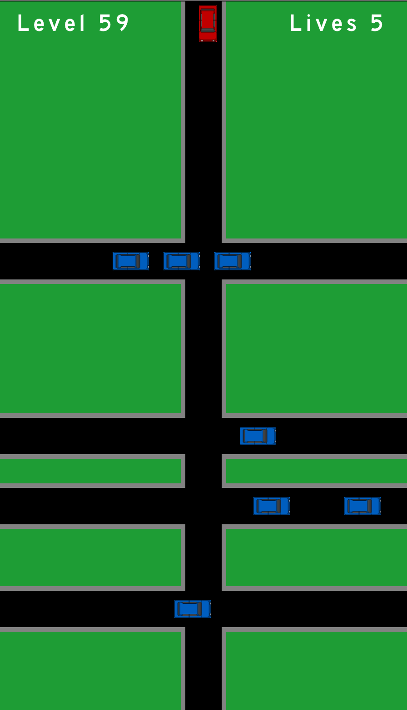

---
_DISCLAIMER:_

Welcome to **raylib game template**!

This template provides a base structure to start developing a small raylib game in plain C. The repo is also pre-configured with a default `LICENSE` (zlib/libpng) and a `README.md` (this one) to be properly filled by users. Feel free to change the LICENSE as required.

All the sections defined by `$(Data to Fill)` are expected to be edited and filled properly. It's recommended to delete this disclaimer message after editing this `README.md` file.

This template has been created to be used with raylib (www.raylib.com) and it's licensed under an unmodified zlib/libpng license.

_Copyright (c) 2014-2022 Ramon Santamaria ([@raysan5](https://twitter.com/raysan5))_
---

## Frantic Fourways

### Description

The traffic is terrible! Try to get your car past all of the intersections.

### Features

- $(Game Feature 01)
- $(Game Feature 02)
- $(Game Feature 03)

### Controls

Keyboard:

- Down Arrow accelerates
- Up Arrow brakes
- Enter to go to next screen

### Screenshots

### Developers

- @pparke

### Links

- itch.io Release: $(itch.io Game Page)

### Credits

Music: 𝙭𝘢𝒑𝒉𝒐𝙤𝘯 by Apoxode (c) copyright 2021 Licensed under a Creative Commons Attribution Noncommercial (3.0) license. http://dig.ccmixter.org/files/Apoxode/64319 Ft: Joel Frijters
Font: Highway Gothic by Tom Oetken [Ash Pikachu Font] https://www.dafont.com/ashpikachu099.d2541
Car Sprites: Muhammad Amiruddin https://opengameart.org/users/amir027

### License

This game sources are licensed under an unmodified zlib/libpng license, which is an OSI-certified, BSD-like license that allows static linking with closed source software. Check [LICENSE](LICENSE) for further details.

_Copyright (c) 2022 @pparke)_
